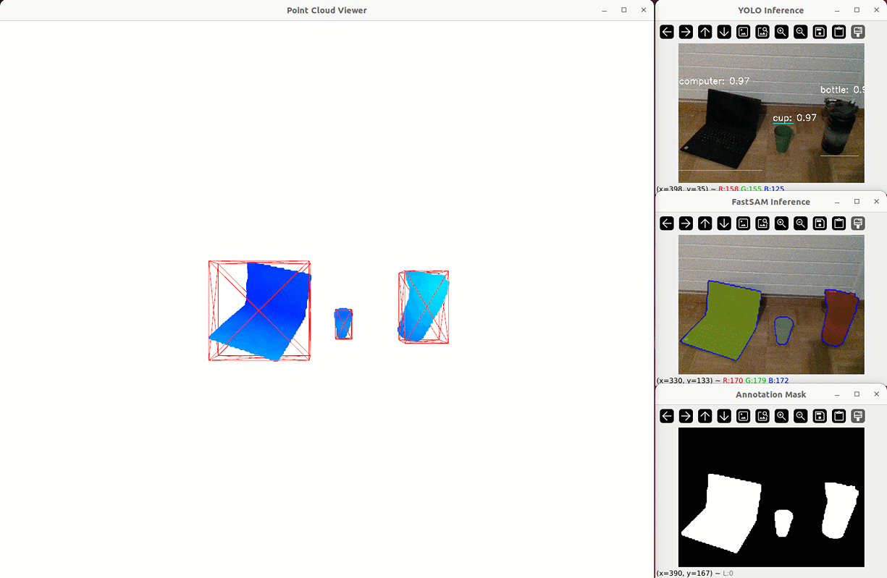

You can find the Pre-print at this link: [ArXiv](https://arxiv.org/abs/2403.00175)
## Introduction

**FusionVision** is a project that combines the power of Intel RealSense RGBD cameras, YOLO for object detection, FastSAM for fast segmentation and depth map processing for accurate 3D.
The goal is to detect objects in a live RGB stream, apply *FastSAM* to segment the detected objects,
and use *RealSense* depth sensor to display the point cloud exclusively for the segmented area allowing a better scene understanding and accurate 3D object reconstruction and localization.
The project is provided with the weights only. You'll find all the related files and training results in [yolo_train](./yolo_train).

A (non-released) Webapp demo preview of YOLO and FastSAM on live realsense stream runing at 30-fps (implemented using [Streamlit](https://streamlit.io/) Workflow):


The development and implementation of the proposed method are structured according to the detailed flowchart outlined below. This comprehensive process ensures a robust and realtime application of the proposed **FusionVision** approach, resulting in a fast determination, 3D localisation and isolation of 3D objects.


You can also check the RGBD 3D segmentation in this GIF:



## Table of Contents

1. [Introduction](#Introduction)
2. [Configuration](#Configuration)
3. [Setup Instructions](#Setup-Instructions)
4. [CUSTOMISED DETECTION](#CUSTOMISED-DETECTION)

## Configuration

This project has been implemented and tested on the following configuration:

- **OS:** [Ubuntu 22.04.3 LTS](https://releases.ubuntu.com/jammy/)
- **OS type:** 64-bit
- **RAM Memory:** 16 GB
- **GPU:** GeForce RTX 2080 Ti
- **Realsense-camera:** D435i


## Setup Instructions

Before starting, please ensure that a virtual environment (`venv`) is created as RealSense cameras are not compatible with conda environments. Follow the steps below for setup:

### 1st Step: Update and Install Dependencies
```bash
sudo apt-get update && upgrade
sudo apt-get install libxcb-cursor0
```

### 2nd Step: Clone Repository and Install Requirements

```bash
git clone https://github.com/safouaneelg/FusionVision.git
cd FusionVision/
pip install -r requirements.txt
```

The project contains an implementation of full view point-cloud 3D reconstruction in [rs_fullview_pcloud](./rs_fullview_pcloud.py).
It includes the RGB stream, Depth stream and point cloud visualisation based on [Open3D](https://www.open3d.org/docs/latest/tutorial/geometry/pointcloud.html) documentation.

You can run the viewer using the following command:

```bash
python rs_fullview_pcloud.py
```

If you'd like to test only the stream from your realsense device, run the following command

```bash
python stream/rs_livestream.py
```

### 3rd Step: SAM installation and static test

Check the notebook [SAM_FastSAM_installation.ipynb](./SAM_FastSAM_installation.ipynb) for more details.
It inculdes the setup of Facebook SAM and FastSAM with some tests on static images.

### Last Step: Visualize YOLO and SAM Inferences

Once your environement is fully set, you can run the py files. Here are the details:

:red_circle: **_DISCLAIMER:_** :red_circle:
_The provided YOLO weights in this code are customly trained, as mentioned in the paper. If **FusionVision** is unable to reconstruct your objects or if the objects to be detected differ from the specified (laptop computer, cup, bottle), it is recommended to use `yolov8x.pt`, `yolov8l.pt`, or `yolov8m.pt` whenever YOLO weights are required in python terminal commands. A pre-trained model will be automatically downloaded and can also be used in the FusionVision code._ :izakaya_lantern: :izakaya_lantern:


The code for **FusionVision** pipeline is available at `FusionVisionV0.3.py`. To run the 3D object detection, segmentation and reconstruction, use the following terminal command:

```bash
python FusionVisionV0.3.py --yolo_weight /path/to/yolo/weight.pt --fastsam_weight FastSAM-x.pt --confidence_threshold 0.7 --conf 0.4 --iou 0.9 --show_3dbbox
```

Where:
  - /path/to/yolo/weight.pt = Path to YOLO weights file (e.g. yolo_train/runs/detect/train/weights/best.pt)
  - FastSAM-x.pt            = FastSAM autodownloadable weight files ('FastSAM-x.pt' or 'FastSAM-s.pt')
  - show_yolo               = (Optional) - Show cv2 window with YOLO detection
  - show_fastsam            = (Optional) - Show cv2 window with FastSAM detection 
  - show_mask               = (Optional) - Show cv2 window with FastSAM detection
  - confidence_threshold    = (Optional) - Confidence threshold for YOLO inference (default: 0.7)
  - conf                    = (Optional) - Set different confidence threshold for the FastSAM model (default: 0.4)
  - iou                     = (Optional) - Set different IoU threshold for non-maximum suppression (default: 0.9)
  - show_3dbbox             = (Optional) - Show in open3D window the 3D bounding box

****************
Additionally:

To visualize YOLO inference in live streaming

```bash
python yolo_inference.py --weights /path/to/yolo/weight.pt --confidence_threshold 0.7 --bbox_color "red" --font_scale 0.5 --font_thickness 1
```

Where:
  - /path/to/yolo/weight.pt = Path to YOLO weights file
  - confidence_threshold  = (Optional) - Confidence threshold for YOLO inference (default: 0.7)
  - bbox_color            = (Optional) - Bounding box color (default: "red")
  - font_scale            = (Optional) - Font scale for displaying class_name (default: 0.5)
  - font_thickness        = (Optional) - Font thickness for displaying class_name (default: 1)

**********  
To visualize only FastSAM estimation (considering YOLO estimated 2D bbox)

```bash
python od_sam_inference.py --yolo_weight /path/to/yolo/weight.pt --fastsam_weight 'FastSAM-x.pt' --show_mask --confidence_threshold 0.7 --conf 0.4 --iou 0.9
```

To visualize both YOLO and SAM inferences simultaneously in two windows

```bash
python yolosam_inference.py  --yolo_weight /path/to/yolo/weight.pt --fastsam_weight 'FastSAM-x.pt' --show_mask --confidence_threshold 0.7 --bbox_color "red" --font_scale 0.5 --font_thickness 1 --conf 0.4 --iou 0.9
```

## CUSTOMISED DETECTION

You can also customise the code on specific objects.

**HOWTO**:

1. Prepare your annotated dataset in YOLO format:

You can achieve this using free annotators like [v7lab](https://www.v7labs.com/image-annotation) or [RoboFlow](https://roboflow.com/) or other annotators of your choice.
In this project RoboFlow has been selected.
Make sure you have in your dataset folder `.yaml` file pointing to the right `train` and `valid` and/or `test` paths.

2. Run the training:

- Option 1: You can follow the tutorial [train_custom_dataset.ipynb](./yolo_train/training_custom_dataset.ipynb)

- Option 2: Run the following command change /path/to/data.yaml and optionally the number of epochs (the default is 100)

```bash
python yolo_train/train_yolo.py --data /path/to/data.yaml --epochs 150
```

3. Test the inference:

You can test the quality of your training using the following command

```bash
python yolo_inference.py --weights /path/to/yolo/weight.pt --confidence_threshold 0.7 --bbox_color "red" --font_scale 0.5 --font_thickness 1
```

choose your colors from the following table:

| Color       | RGB Values          |
|-------------|---------------------|
| red         | (0, 0, 255)         |
| green       | (0, 255, 0)         |
| blue        | (255, 0, 0)         |
| yellow      | (0, 255, 255)       |
| purple      | (128, 0, 128)       |
| orange      | (0, 165, 255)       |
| cyan        | (255, 255, 0)       |
| magenta     | (255, 0, 255)       |
| pink        | (203, 192, 255)     |
| teal        | (128, 128, 0)       |
| lime        | (0, 255, 0)         |
| brown       | (42, 42, 165)       |
| maroon      | (0, 0, 128)         |
| navy        | (128, 0, 0)         |
| olive       | (0, 128, 128)       |
| gray        | (128, 128, 128)     |
| silver      | (192, 192, 192)     |
| gold        | (0, 215, 255)       |
| turquoise   | (208, 224, 64)      |
| violet      | (211, 0, 148)       |
| indigo      | (130, 0, 75)        |
| lavender    | (208, 184, 170)     |
| peach       | (255, 218, 185)     |
| salmon      | (114, 128, 250)     |
| sky_blue    | (235, 206, 135)     |
| tan         | (140, 180, 210)     |
| dark_green  | (0, 100, 0)         |
| dark_red    | (0, 0, 139)         |
| dark_blue   | (139, 0, 0)         |


<em>Common_errors</em>:

- If you have errors while running the training code replace all relative paths with absolute path in the `.yaml` file and the training code.
- If you're encountring errors while runing the inference, it's probably due to ultralytics versionning.
Make sure you train YOLO on you custom dataset using the version ultralytics==8.0.120.

- If you have the following error, it's probably due to USB port failing to receive the frames:
        ```RuntimeError: Frame didn't arrive within 5000```
change the port or try again.

## Citation

If you use our repository or any of our implementation please cite us:
```
@misc{ghazouali2024fusionvision,
      title={FusionVision: A comprehensive approach of 3D object reconstruction and segmentation from RGB-D cameras using YOLO and fast segment anything}, 
      author={Safouane El Ghazouali and Youssef Mhirit and Ali Oukhrid and Umberto Michelucci and Hichem Nouira},
      year={2024},
      eprint={2403.00175},
      archivePrefix={arXiv},
      primaryClass={cs.CV}
}
```

## LICENCE

This code is made available for research purposes only and is not licensed for commercial use.
